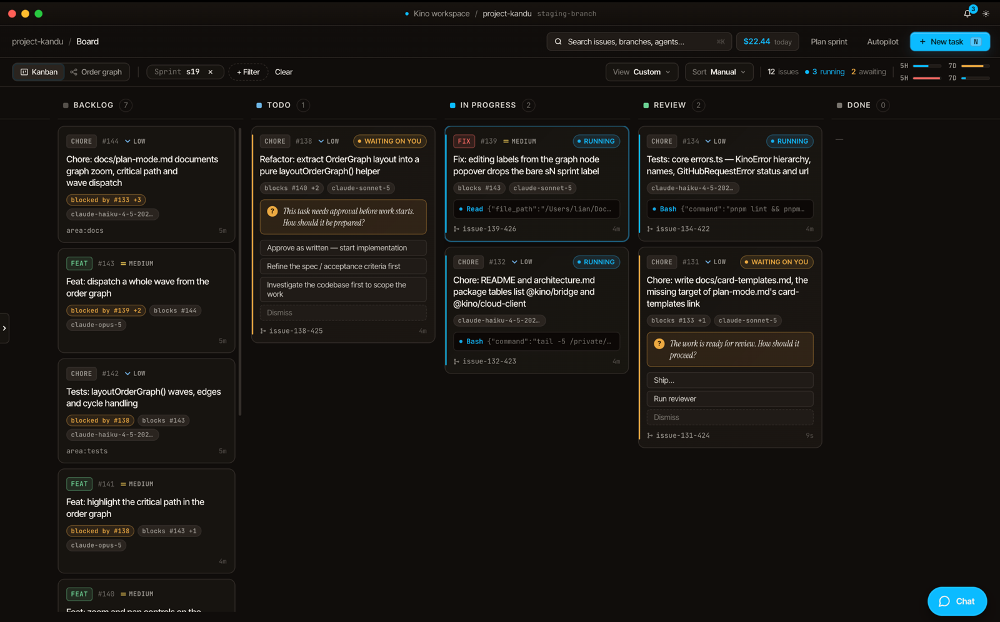
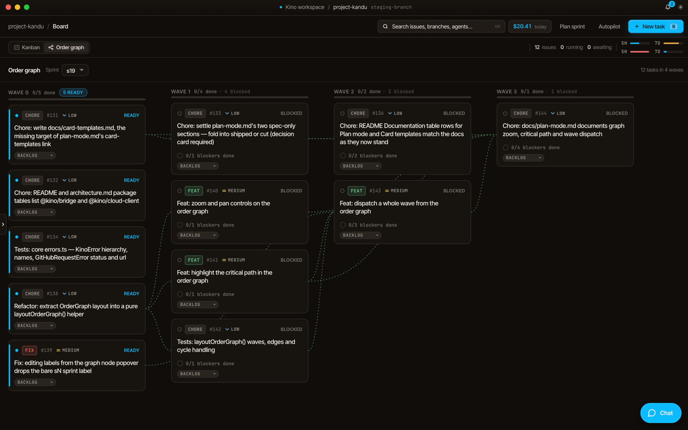
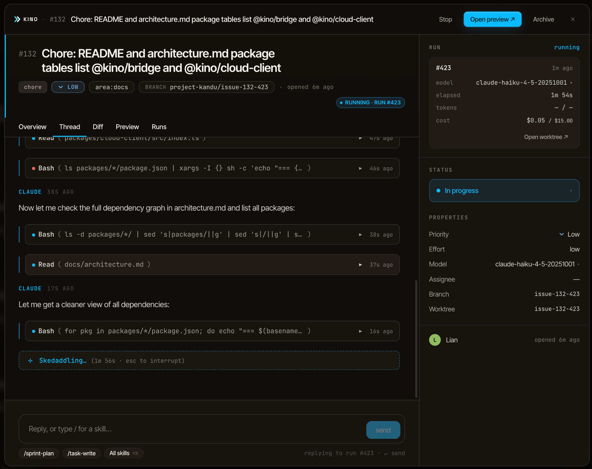
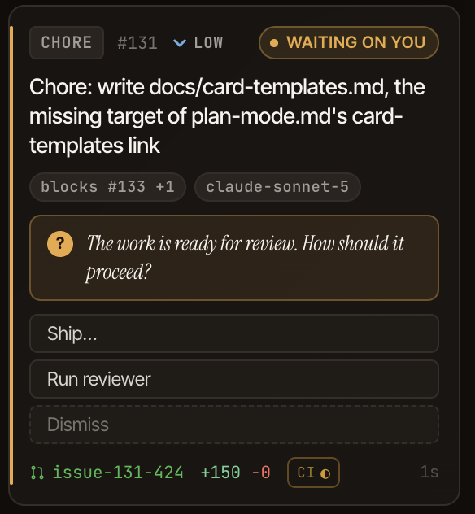
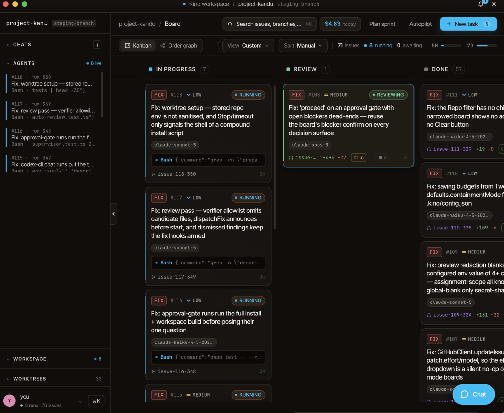
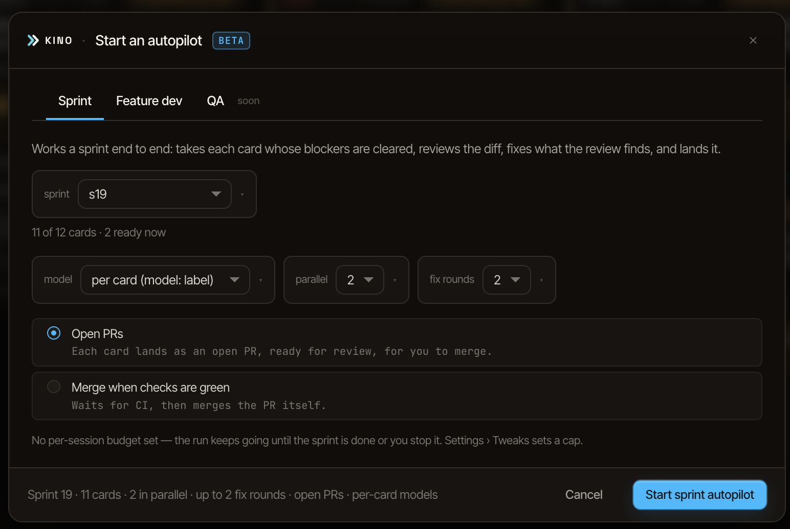
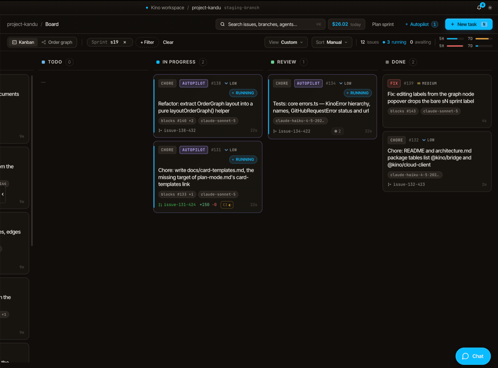
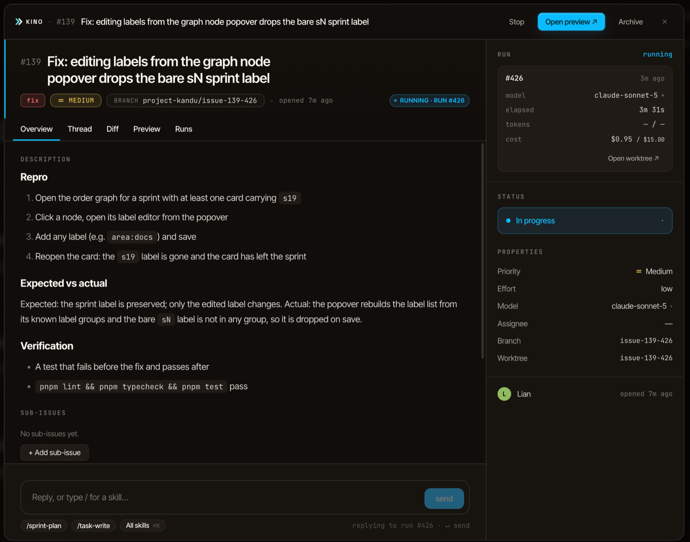
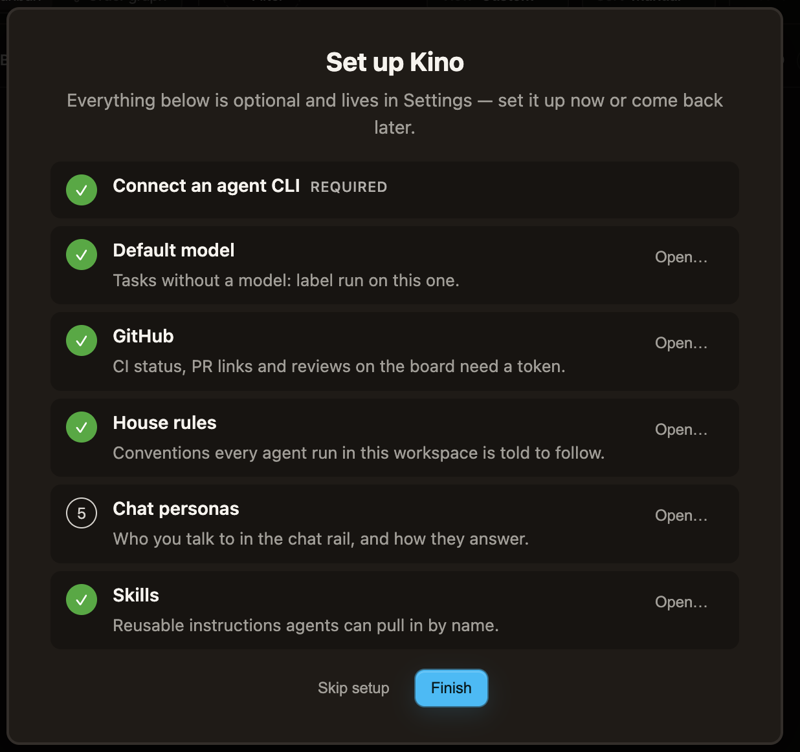

# Kino

**The agentic workflow platform that lets one person ship a whole sprint.**
Built for agent-native companies: teams where the humans plan and review,
and coding agents do the work.



Kino is a desktop app. Point it at a git repository and it gives you a kanban
board where every card can be handed to a coding agent (Claude Code, Codex,
Gemini, Cursor, Copilot, Amp, OpenCode, Droid, CCR, Qwen, or any
ACP-compatible CLI), each run isolated in its own git worktree, many at
once. Plan the sprint with an agent, dispatch the cards, let a second agent
review the work, ship it. Or turn on autopilot and have the sprint run itself
in dependency order while you sleep.

Free to use. This repo hosts the downloads; the source is not public.

**[Download the latest build →](../../releases/latest)** for macOS (Apple
Silicon and Intel), Windows and Linux. Builds are unsigned; see
[First launch](#first-launch-read-this) for the one-time step.

## The workflow

### Plan

Open **Plan sprint**, describe the sprint to a planner agent, and watch the
task list build as you talk: each task gets a body, a reasoning effort, a
model hint, and its dependencies. When the planner needs a call from you it
asks, with a recommended option. Submit publishes the whole plan in one
transaction and lands you on the **order graph**, laid out in waves. Wave 0
is ready now, and everything behind it is blocked until its predecessors
land.



### Dispatch

Click Dispatch on a card (or select several). Kino creates a worktree off
your target branch, launches the agent CLI against it, and streams every tool
call into the card's thread. Model and reasoning effort come from the card's
labels; elapsed time, tokens and cost tick up in the run panel against the
per-run budget.



When the agent needs a decision, the run pauses and the options appear on
the card itself. Click one and it continues. Create a card with **Spec
first** and the same gate holds it before any work starts: approve as
written, refine the spec, or investigate the codebase first.

### Review

A finished run doesn't move to Done on its own. The card asks: **Ship**, or
**Run reviewer**. A reviewer run, always on a different model tier than the
author, reads the diff and files findings against the card. **Fix with
agent** dispatches a fix run stamped with those findings; findings whose
lines the fix rewrote are closed automatically, the rest get a cheap
verification pass. Turn on auto-review and every completed run gets this
without a click.

<p align="center"></p>

### Ship

Promote the worktree as a commit on your branch, open a draft PR, or
**Merge**: push, un-draft, merge with the repo's own merge method, and
fast-forward your local branch. Branch preview starts the worktree's dev
server for a look first. PR and CI status sit on the card while you wait.



### Autopilot (beta)

Pick a sprint, how many cards run in parallel, how many fix rounds each gets,
and a landing mode, then walk away. The session dispatches ready cards as
their blockers close, runs the review → fix loop on each, auto-answers
decisions that have a single recommended option, and lands the card: either
open PRs stacked on unmerged predecessors, or **merge when checks are
green**, which pushes, polls CI and merges. Anything that can't be landed
cleanly is held for you rather than forced through. A per-session budget
(Settings → Tweaks) stops it cold.





## Cards are specs, not sticky notes

Every card carries a body an agent can act on: what to do, how to reproduce
it, how to verify it. The planner writes them that way; the New task modal
nudges you to. An agent that starts from a card like this doesn't have to
guess, and a reviewer has something to check against.



## Everything else on the board

- **Local or GitHub issues.** Default is a local SQLite board in `.kino/`.
  Switch to GitHub mode to drive the repo's real issues; column moves become
  `status:*` label edits.
- **Sentry import.** Pull error groups onto the board for triage; one click
  hands one to an agent.
- **11 agent CLIs**, chosen per dispatch, each reusing its own login.
  Models-by-action settings pick which tier does work, review, and
  verification.
- **Containment.** Every tool call is checked against the worktree root;
  edits outside it are logged or pause the run for your decision.
- **Cost budgets** per run and per autopilot session. A run that crosses
  its cap is stopped.
- **MCP server.** `kino-mcp-server` exposes the board over Model Context
  Protocol, so Cursor, Claude Desktop, or the Claude Code CLI can read and
  write cards.
- **Chat rail.** Talk to an agent about the board itself (plan, split,
  archive, open a PR for a card) with personas you define.
- **Notifications.** An in-app toast when a Kino window is focused, an OS
  notification when it isn't, for run outcomes, decisions, PRs, updates,
  and usage warnings.

## Download

Latest build: **[releases/latest](../../releases/latest)**

| Platform            | File                                |
| ------------------- | ----------------------------------- |
| macOS Apple Silicon | `kino-<version>-mac-arm64.dmg`      |
| macOS Intel         | `kino-<version>-mac-x64.dmg`        |
| Windows x64         | `kino-<version>-win-x64.exe`        |
| Linux x64           | `kino-<version>-linux-x64.AppImage` |
| Linux x64           | `kino-<version>-linux-x64.tar.xz`   |

## First launch: read this

Builds are **not code-signed** (certificates are a recurring cost this project
does not carry yet). Your OS will object the first time, once:

### macOS

Drag `Kino.app` to `/Applications`, then:

- **macOS 15 and newer:** you'll see _"Kino is damaged and can't be opened.
  You should move it to the Trash."_ It is not damaged; that is the wording
  macOS uses for unsigned apps now, and right-click → Open does **not** get
  past it. Clear the quarantine flag:

  ```sh
  xattr -dr com.apple.quarantine "/Applications/Kino.app"
  ```

  Then open it normally.

- **macOS 14 and older:** you'll see _"Apple cannot check it for malicious
  software."_ Right-click the app, choose **Open**, then **Open** again.

### Windows

SmartScreen shows _"Windows protected your PC."_ Click **More info** →
**Run anyway**.

### Linux

AppImage: `chmod +x kino-<version>-linux-x64.AppImage` and run it.
Tarball: extract anywhere and run `./kino`.

You only go through this once per machine.

## What you need

Kino doesn't sign you in to anything. It calls the agent CLIs already on
your `PATH`, reusing whatever auth they have. Install **at least one**:

| Agent              | CLI            | Sign in                 |
| ------------------ | -------------- | ----------------------- |
| Claude Code        | `claude`       | `claude /login`         |
| Codex              | `codex`        | `codex login`           |
| Gemini             | `gemini`       | `gemini auth`           |
| Cursor CLI         | `cursor-agent` | `cursor-agent login`    |
| GitHub Copilot CLI | `gh-copilot`   | `gh auth login`         |
| Amp                | `amp`          | `amp login`             |
| OpenCode           | `opencode`     | `opencode auth`         |
| Droid              | `droid`        | `droid auth`            |
| CCR                | `ccr`          | reuses Claude Code auth |
| Qwen Code          | `qwen`         | `qwen auth`             |

You'll also want **git**. Add `gh` + `gh auth login` if you want Kino to
drive real GitHub Issues, open PRs, or merge for you.

## First run

Pick any folder containing a git repository. Kino creates a `.kino/`
directory inside it (SQLite database, config, per-run worktrees) and drops
you on the board. Nothing is written outside that directory.

A fresh install opens on a short setup checklist. Only the first step, an
agent CLI on your `PATH`, gates the board. Everything else can wait and
lives in Settings.

<p align="center"></p>

Your data is local. There is no account and no server.

## Updating

Kino checks for updates automatically and lets you know two ways: a toast
in the app, and a **Check for updates** entry in the account menu
(bottom-left).

- **macOS (signed), Windows, Linux AppImage:** the update downloads in
  the background and installs the next time you quit. The toast says
  "Update ready"; click it (or the account menu entry) to restart now.
- **macOS (unsigned), Linux tar.xz:** the app can see a new version but
  can't install it in place. The toast says "Update available"; click it
  to open this releases page and download the new build the same way you
  got this one.

You can also watch this repo (**Watch → Custom → Releases**) to hear
about new versions as they're published.

## What keeps agents in their lane

Agents write and delete files in the repositories you point them at, and
spawn processes on your machine. Kino puts fences around that:

- Every run works in its own git worktree, never your checkout.
- A pre-push hook in every worktree stops agents pushing on their own.
- Containment mode watches for edits outside the worktree.
- Cost budgets stop runaway runs and sessions.
- Landing on a real branch (commit, PR, or merge) is always an explicit
  click, or an autopilot landing mode you chose when you started the
  session.

Even so: **review what an agent produces before you promote it, and keep
backups.**

## Reporting a problem

Choose **Feedback** in Kino's account menu, or open
[a new issue](https://github.com/LiansTech/kino-releases/issues/new/choose) on this
repo. Pick **Bug report** or **Feature request** and complete the form. Kino
prefills its version when you open Feedback from the app.

## License

Proprietary. Copyright © 2026 LiansTech. All rights reserved. Free to download
and use; not open-source, and not redistributable. Bundled third-party
open-source components keep their own licenses.
